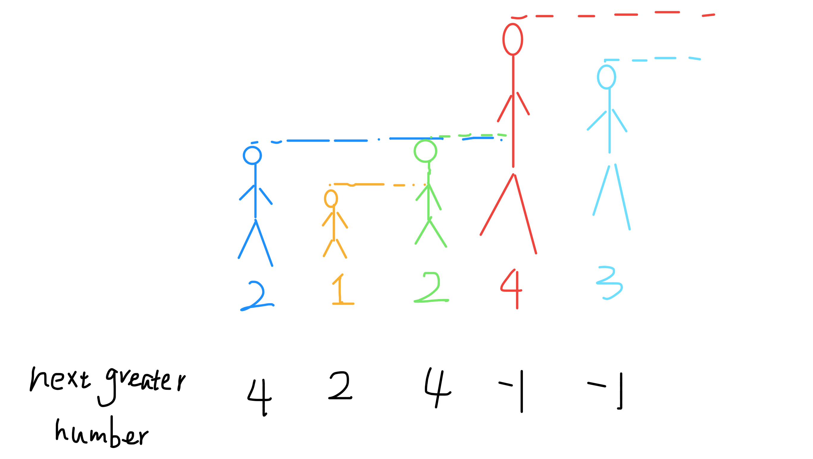
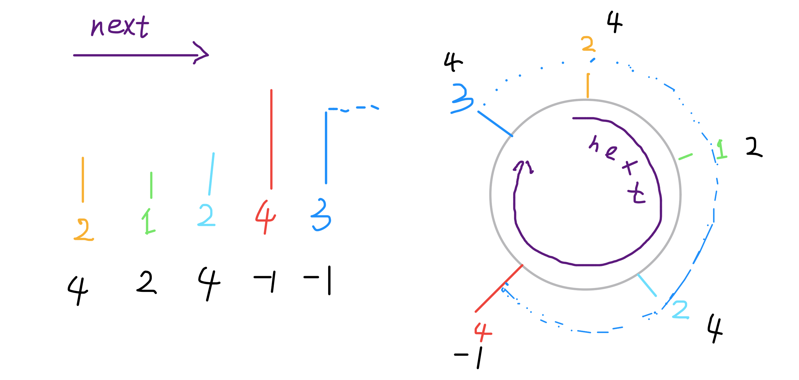
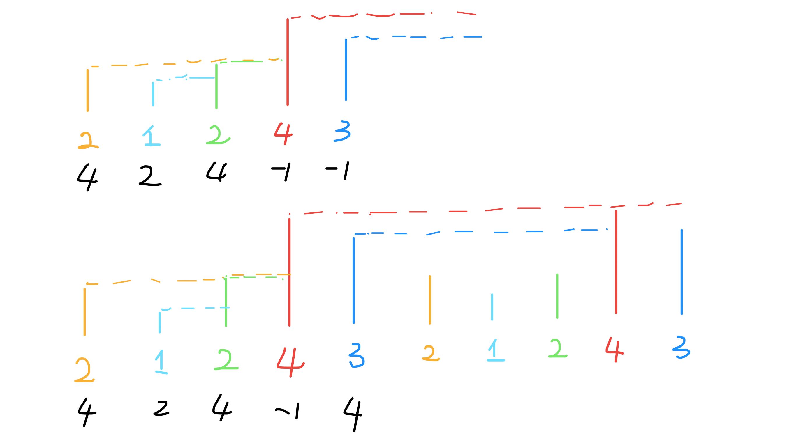

### How to solve problems with a monotonic stack

**Translator: [nettee](https://github.com/nettee)**

**Author: [labuladong](https://github.com/labuladong)**

Stack is a very simple data structure, with a logical order of last-in-first-out (LIFO). Stack conform to the characteristics of some problems, such as function call stacks.

A monotonic stack is just a stack essentially. However, with some tricks, it keeps the elements in the stack orderly (either increasing or decreasing) whenever new elements are pushed on.

Sounds a bit like a heap? No, it's not a heap. Monotonic stack has restricted applications. It deals with a typical problem called *Next Greater Element* only. This article is going to solve such problems using the algorithm template that solves monotonic queue problems, and discuss the strategy to deal with "circular arrays".

First, let's talk about the original problem of Next Greater Element. You are given an array of integers. Find the next greater elements for each number in the array. You should return an array with the same size containing the next greater elements. If there is no greater elements, output -1 for this number. For example:

+ Input: `[2,1,2,4,3]`
+ Output: `[4,2,4,-1,-1]`
+ Explanation:
  + For number 2, the next greater number is 4.
  + For number 1, the next greater number is 2.
  + For the second 2, the next greater number is 4.
  + For number 4, there is no greater numbers, so output -1.
  + For number 3, there is no greater numbers after it, so output -1.

It is easy to come up with a naive solution. For each number in the array, scan the elements after it, and find the first larger element. However, the time complexity of this naive solution is  O(n^2).

You can think of this problem in such an abstract way: imagine the elements of the array as people standing in a line, and the value of the elements as the height of each person. You stand facing this line of people. How to find the Next Greater Number of element "2"? It's easy. If you could see the element "2", then the fist person visible behind him is the Next Greater Number of "2", as the elements less than "2" are not tall enough and are blocked by "2".



Easy to understand! With this abstract scenario, let's take a look at the code.

```cpp
vector<int> nextGreaterElement(vector<int>& nums) {
    vector<int> ans(nums.size()); // the result array
    stack<int> s;
    for (int i = nums.size() - 1; i >= 0; i--) { // push onto the stack backward
        while (!s.empty() && s.top() <= nums[i]) { // comparing the height
            s.pop(); // fuck off the shorter ones, you are already blocked...
        }
        ans[i] = s.empty() ? -1 : s.top(); // the next greater taller element
        s.push(nums[i]); // join the line and accept the height comparison!
    }
    return ans;
}
```

THIS is the template for monotonic stacks to solve problem. The for loop should scan elements from back to front, because as we are using a stack, pushing onto the stack backwards means popping from the stack forwards. The while loop is to emit the elements between two "tall people", because they have no meaning to exist. With a "taller" element standing in front, they can never become the Next Greater Number of the subsequent coming elements.

The time complexity of this algorithm is not so intuitive. You may think the algorithm to run in O(n^2), as a for loop is nested in a while loop. However, this algorithm takes only O(n) time actually.

To analyze its time complexity, we need to consider in a whole. There are n elements in total, and each elements is pushed onto the stack once, and popped at most once, without any redundant operations. Thus, the total computing scale is proportional to the element scale n, which is the complexity of O(n).

Now, you have mastered the use of monotonic stacks. Let's take a simple variant of this problem to deepen your understanding.

You are given an array T = [73, 74, 75, 71, 69, 72, 76, 73], the list of daily temperatures. You should return an array that, for each day in the input, how many days you would have to wait until a warmer temperature. If there is no such future day, put 0 instead.

For example, given T = [73, 74, 75, 71, 69, 72, 76, 73], your output should be [1, 1, 4, 2, 1, 1, 0, 0].

Explanation: The temperature is 73 at the first day, and 74 at the second day, which is larger than 73. So for the first day, you only need to wait for one day for a warmer temperature. It is similar for the other days.

You are already a little sensitive to this kind of Next Greater Number problem. This problem is essentially looking for Next Greater Numbers, but instead of what the Next Greater Number is, you are asked the distance from the Next Greater Number.

So this is a problem with the same type and the same idea. You can use the template of monotonic stack directly with some slight change in code. Let's show the code.

```cpp
vector<int> dailyTemperatures(vector<int>& T) {
    vector<int> ans(T.size());
    stack<int> s; // store index of elements, instead of element itself
    for (int i = T.size() - 1; i >= 0; i--) {
        while (!s.empty() && T[s.top()] <= T[i]) {
            s.pop();
        }
        ans[i] = s.empty() ? 0 : (s.top() - i); // calculate the distance of indexes
        s.push(i); // push the index instead of element
    }
    return ans;
}
```

That's all for the explanation of monotonic stack. Next, we will talk about another important topic: how to deal with "circular arrays".

Now suppose the same Next Greater Number problem, with the array arranging in a ring. How to deal with it?

Given an array [2,1,2,4,3], you should output array [4,2,4,-1,4]. On a ring, the last element 3 travels a round and find an element 4 larger than itself.



First, the storage in computer is linear, and there are actually no circular array. But we can simulate the effect of circular arrays. Usually we obtain this effect by the modulus (remainder) operation and the % operator:

```java
int[] arr = {1,2,3,4,5};
int n = arr.length, index = 0;
while (true) {
    print(arr[index % n]);
    index++;
}
```

Let's back to the Next Greater Number problem. In the case of ring, the difficulty of the problem is that, "next" not only refer to the right side of the current element, but also the left side of the current element, as shown in the example above.

The problem is half solved by identifying it. We can consider the idea of "doubling" the original array, that is, putting a same array right behind it. In this way, following the previous process of "comparing the height", each element can be compared to not only the elements on its right, but also the elements on its left.



How to implement this idea? You can of course construct this double-length array and then apply the algorithm template. However, we can just use the tricks of circular array to simulate the double-length array. Let's look at the code:

```cpp
vector<int> nextGreaterElements(vector<int>& nums) {
    int n = nums.size();
    vector<int> res(n); // the result array
    stack<int> s;
    // pretend that the length of the array is doubled
    for (int i = 2 * n - 1; i >= 0; i--) {
        while (!s.empty() && s.top() <= nums[i % n])
            s.pop();
        res[i % n] = s.empty() ? -1 : s.top();
        s.push(nums[i % n]);
    }
    return res;
}
```

Now you have mastered the design and code template of monotonic stacks, the solutions to Next Greater Number, and how to deal with circular arrays.