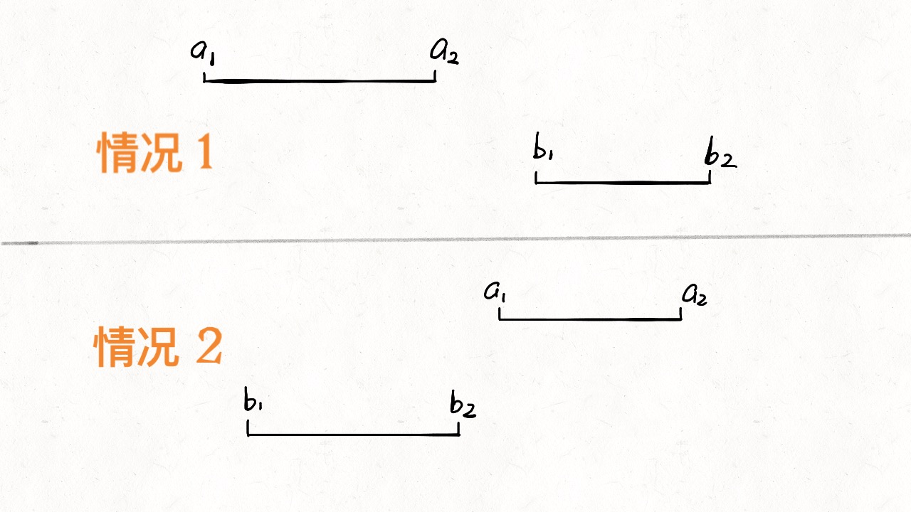
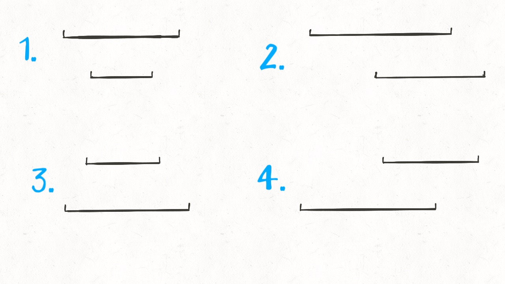
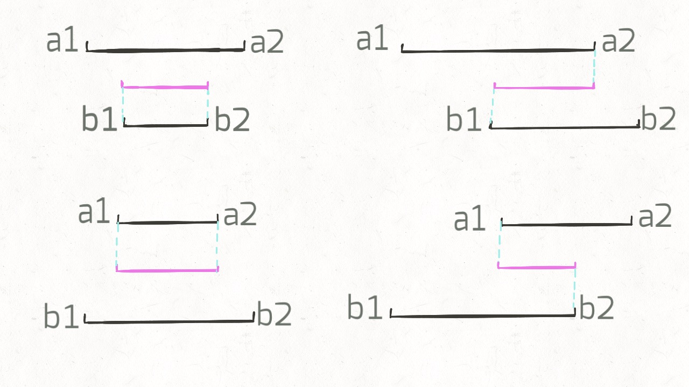
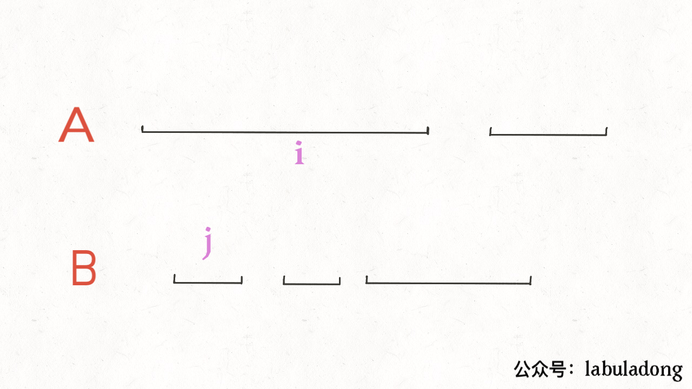

# Interval Problem (III): Interval Intersection


**Translator: [GYHHAHA](https://github.com/GYHHAHA)**

**Author: [labuladong](https://github.com/labuladong)**

This is the third article about the interval problem, and the last two articles respectively introduce the interval scheduling problem and the interval merging problem. Now, we will talk about the topic about how to find out interval intersection from two set of intervals efficiently.

【Leetcode 986】Interval List Intersections

Given two lists of **closed** intervals, each list of intervals is pairwise disjoint and in sorted order.

Return the intersection of these two interval lists.

*(Formally, a closed interval [a, b] (with a <= b) denotes the set of real numbers xwith a <= x <= b.  The intersection of two closed intervals is a set of real numbers that is either empty, or can be represented as a closed interval.  For example, the intersection of [1, 3] and [2, 4] is [2, 3].)*

**Example 1:**

****

```
Input: A = [[0,2],[5,10],[13,23],[24,25]], B = [[1,5],[8,12],[15,24],[25,26]]
Output: [[1,2],[5,5],[8,10],[15,23],[24,24],[25,25]]
Reminder: The inputs and the desired output are lists of Interval objects, and not arrays or lists.
```

**Note:**

1. `0 <= A.length < 1000`
2. `0 <= B.length < 1000`
3. `0 <= A[i].start, A[i].end, B[i].start, B[i].end < 10^9`

**NOTE:** input types have been changed on April 15, 2019. Please reset to default code definition to get new method signature.

### Part One: Thought

The general thought for interval problems is sorting first. Since question states that it has been ordered, then we can use two pointers to find out the intersections. 

Here is the code:

```python
# A, B like [[0,2],[5,10]...]
def intervalIntersection(A, B):
    i, j = 0, 0
    res = []
    while i < len(A) and j < len(B):
        # ...
        j += 1
        i += 1
    return res
```

Next, we will analyze all the situations or cases.

First, for two intervals, we use  `[a1,a2]` and `[b1,b2]` to represent two intervals in the  `A` and `B` respectively. So, let us find out how to make these two intervals don't have intersections.



It can be written in code like this:

```
if b2 < a1 or a2 < b1:
    [a1,a2] and [b1,b2] don't exist intersection
```

Then, what conditions should be met when two intervals exist intersection? 

The negative proposition of the above logic is the condition.

```python
# get a inverse direction of the sign of inequality, and change 'or' into 'and'
if b2 >= a1 and a2 >= b1:
    [a1,a2] and [b1,b2] exist intersection
```

Then, we enumerate all the situation that two intervals exist intersection.



It seems very simple: only four situation. exist. Then we should think about what's the common feather among these situations.



We surprisingly observe that the intersection of intervals get regular pattern. If the intersection is  `[c1,c2]` then `c1=max(a1,b1)`,`c2=min(a2,b2)`! Thus this observation is the key point of finding out the interaction. Now we make our code get further.

```python
while i < len(A) and j < len(B):
    a1, a2 = A[i][0], A[i][1]
    b1, b2 = B[j][0], B[j][1]
    if b2 >= a1 and a2 >= b1:
        res.append([max(a1, b1), min(a2, b2)])
    # ...
```

Last step, it's surely that the pointer  `i` and `j`  will go forward, but when?



It's more understandable throught the gif that whether going forward only depends on the relationship between  `a2` and`b2`.

```python
while i < len(A) and j < len(B):
    # ...
    if b2 < a2:
        j += 1
    else:
        i += 1
```

### Second Part: Code

```python
# A, B like [[0,2],[5,10]...]
def intervalIntersection(A, B):
    i, j = 0, 0 # double pointers
    res = []
    while i < len(A) and j < len(B):
        a1, a2 = A[i][0], A[i][1]
        b1, b2 = B[j][0], B[j][1]
        # two intervals have intersection
        if b2 >= a1 and a2 >= b1:
            # compute the intersection and add it into res
            res.append([max(a1, b1), min(a2, b2)])
        # Pointer go forward
        if b2 < a2: j += 1
        else:       i += 1
    return res
```

To give a brief summary, although the problem concerning intervals seems to be complicated, we can still use simple code to finish the task by observe common features between different situation.
